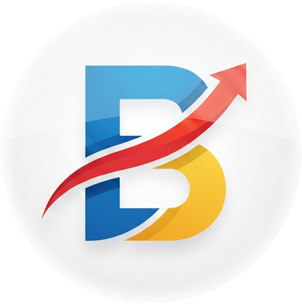

# BrowSifyWeb Browser

&nbsp;Stable: 
&nbsp;Latest: 

BrowSifyWeb browser is a fork of [Yuzu browser](https://github.com/hazuki0x0/YuzuBrowser), an open source power user web browser.

You can create your own browser using custom UI and custom buttons.

Yuzu Browser in turn was based on Mikan Browser.

## Version
Current major version: **7**

BrowSifyWeb continues from where Yuzu Browser left off.
Versioning is intentionally kept as a legacy continuation so users can understand this project as the line of the same browser family in a different fork.

## New in BrowSifyWeb
- Private tab workflow improvements with clear private tab markers and private-start-page handling.
- Private tabs are excluded from session restore after app relaunch.
- New tabs opened from private tabs stay private.
- Speed dial pages now refresh live after add/edit/delete/reorder actions.
- Snackbar/theme behavior has been aligned for more reliable day/night color consistency.
- Ongoing updates for modern Android/Gradle/Kotlin toolchains while preserving legacy browser behavior.

## Download and install
**Android 6.0 or higher is required.**

Or prebuilt apk file is here

https://github.com/vivekjishtu/BrowSifyWeb/releases

## Contributing
Contributions are always welcome

TL;DR
- Create an issue (except for minor fixes and additional translations/translation fixes).
- Create a branch for your patch.
- Create a pull request on the dev branch.

Details are in [Contributing.md](Contributing.md)

## License BSW Browser
    Copyright (C) 2024 Vivek Jishtu

    Licensed under the Apache License, Version 2.0 (the "License");
    you may not use this file except in compliance with the License.
    You may obtain a copy of the License at

        http://www.apache.org/licenses/LICENSE-2.0

    Unless required by applicable law or agreed to in writing, software
    distributed under the License is distributed on an "AS IS" BASIS,
    WITHOUT WARRANTIES OR CONDITIONS OF ANY KIND, either express or implied.
    See the License for the specific language governing permissions and
    limitations under the License.

## License Yuzu Browser
    Copyright (C) 2017-2021 Hazuki

    Licensed under the Apache License, Version 2.0 (the "License");
    you may not use this file except in compliance with the License.
    You may obtain a copy of the License at

        http://www.apache.org/licenses/LICENSE-2.0

    Unless required by applicable law or agreed to in writing, software
    distributed under the License is distributed on an "AS IS" BASIS,
    WITHOUT WARRANTIES OR CONDITIONS OF ANY KIND, either express or implied.
    See the License for the specific language governing permissions and
    limitations under the License.
